# Diagram index

Auto-generated by `scripts/generate-index.py` -- do not hand-edit,
re-run the script instead.

- [CCM](#ccm)
- [CCM](#ccm-1)
  - [Archive](#archive)
- [Facilities_and_Infrastructure](#facilities_and_infrastructure)

## CCM

| Diagram | Preview | Edit |
|---|---|---|
| AccessControl | 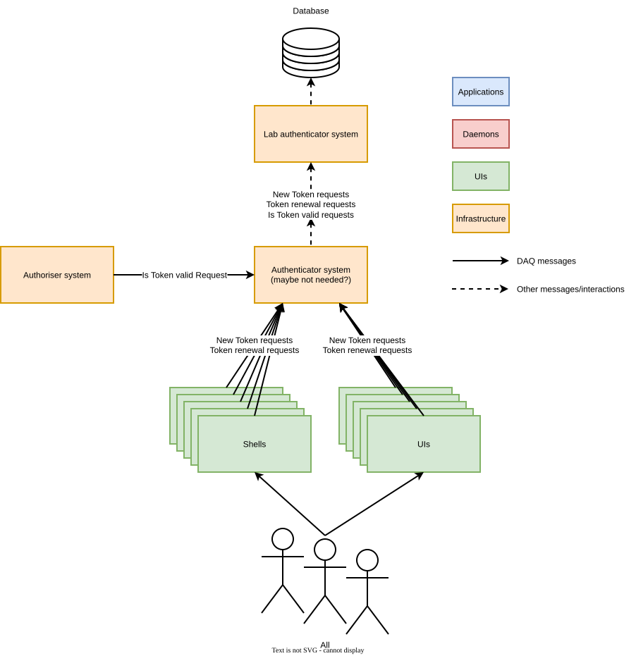 | [Open in draw.io](https://app.diagrams.net/#HPawelPlesniak%2Fdunedaq-diagrams%2Fmain%2Fsrc%2FCCM%2FAccessControl.drawio) |
| Authorisation | 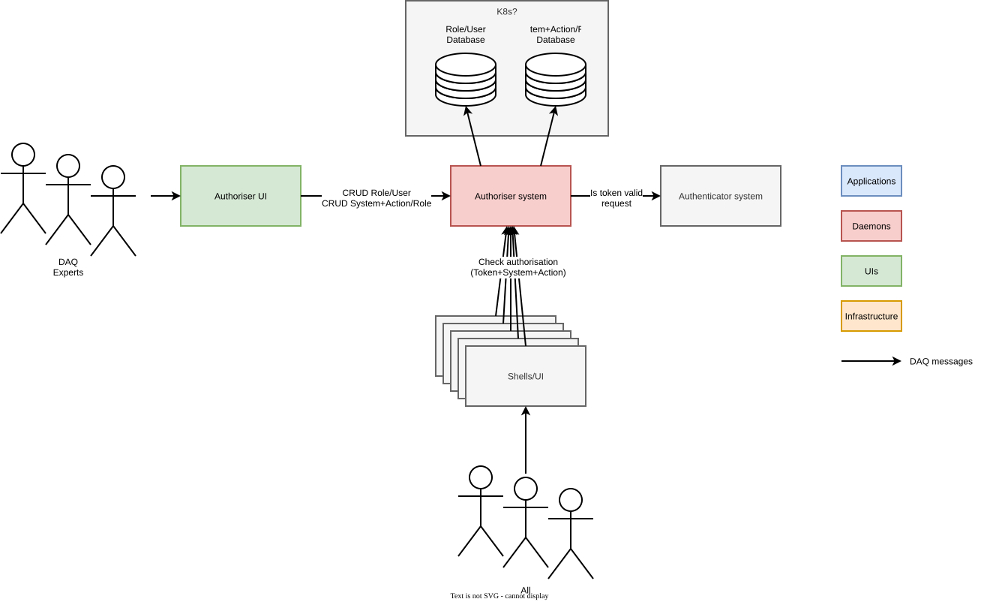 | [Open in draw.io](https://app.diagrams.net/#HPawelPlesniak%2Fdunedaq-diagrams%2Fmain%2Fsrc%2FCCM%2FAuthorisation.drawio) |
| Configuration | 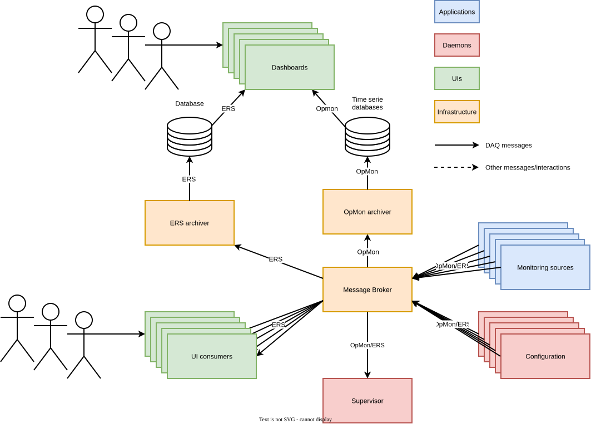 | [Open in draw.io](https://app.diagrams.net/#HPawelPlesniak%2Fdunedaq-diagrams%2Fmain%2Fsrc%2FCCM%2FConfiguration.drawio) |
| Controller | 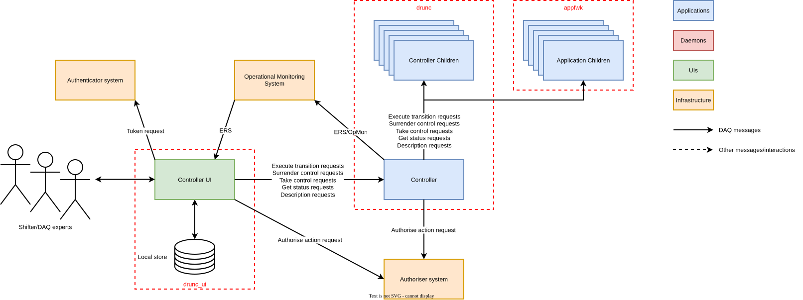 | [Open in draw.io](https://app.diagrams.net/#HPawelPlesniak%2Fdunedaq-diagrams%2Fmain%2Fsrc%2FCCM%2FController.drawio) |
| Monitoring | 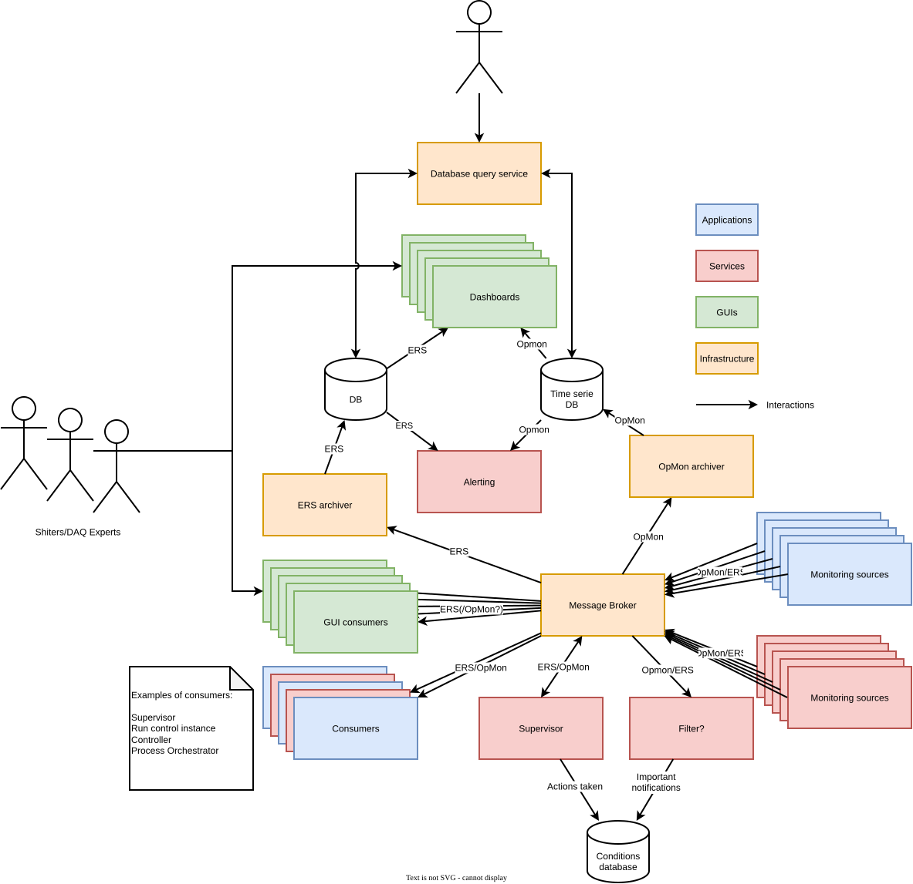 | [Open in draw.io](https://app.diagrams.net/#HPawelPlesniak%2Fdunedaq-diagrams%2Fmain%2Fsrc%2FCCM%2FMonitoring.drawio) |
| ProcessManager | 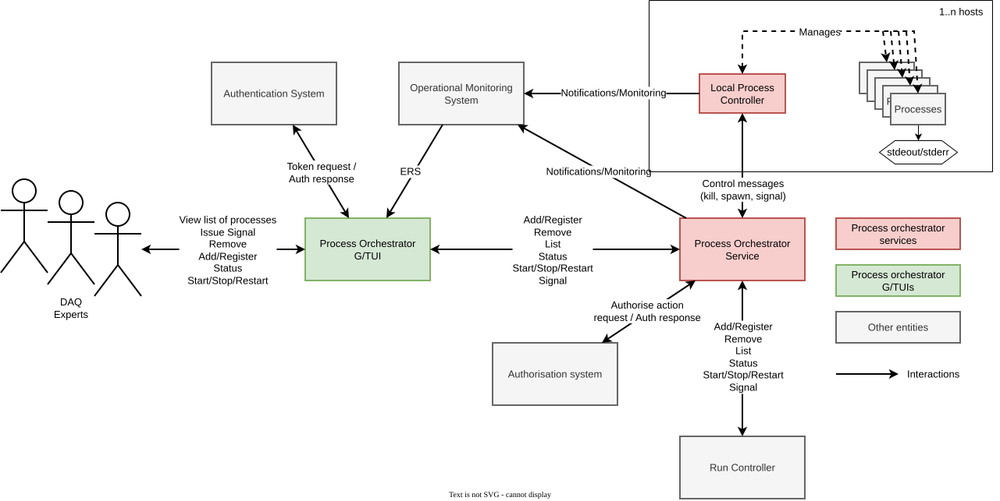 | [Open in draw.io](https://app.diagrams.net/#HPawelPlesniak%2Fdunedaq-diagrams%2Fmain%2Fsrc%2FCCM%2FProcessManager.drawio) |
| ResourceManager | 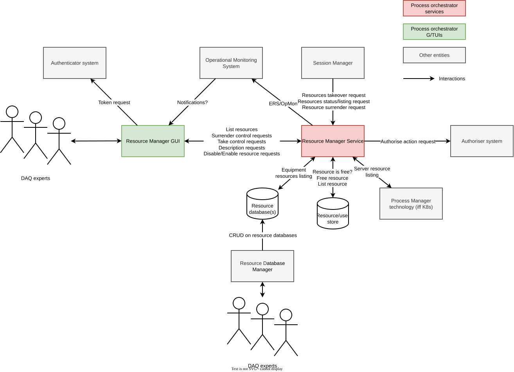 | [Open in draw.io](https://app.diagrams.net/#HPawelPlesniak%2Fdunedaq-diagrams%2Fmain%2Fsrc%2FCCM%2FResourceManager.drawio) |
| RunControl | 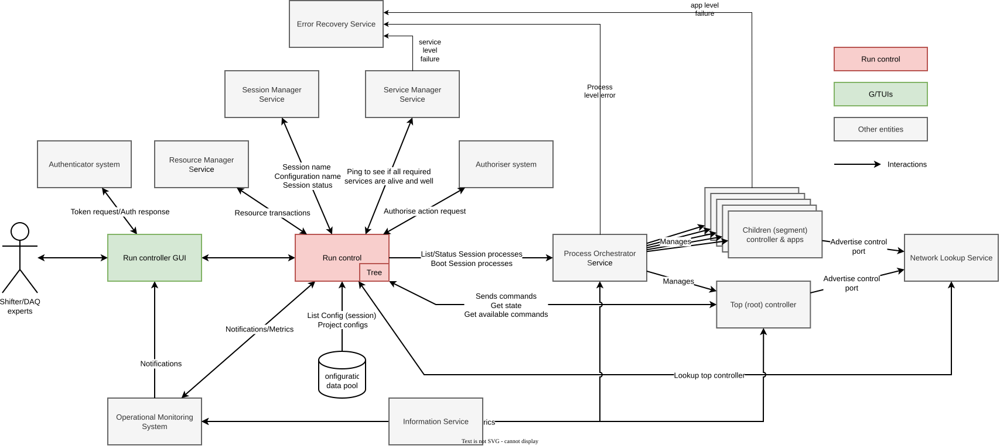 | [Open in draw.io](https://app.diagrams.net/#HPawelPlesniak%2Fdunedaq-diagrams%2Fmain%2Fsrc%2FCCM%2FRunControl.drawio) |
| SessionManager | 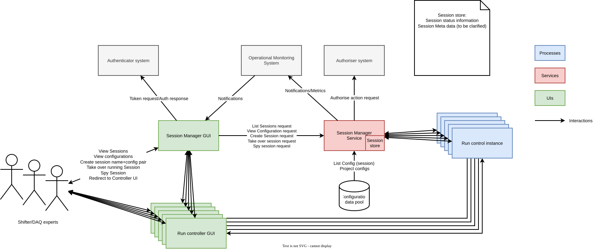 | [Open in draw.io](https://app.diagrams.net/#HPawelPlesniak%2Fdunedaq-diagrams%2Fmain%2Fsrc%2FCCM%2FSessionManager.drawio) |
| SessionManager2 | 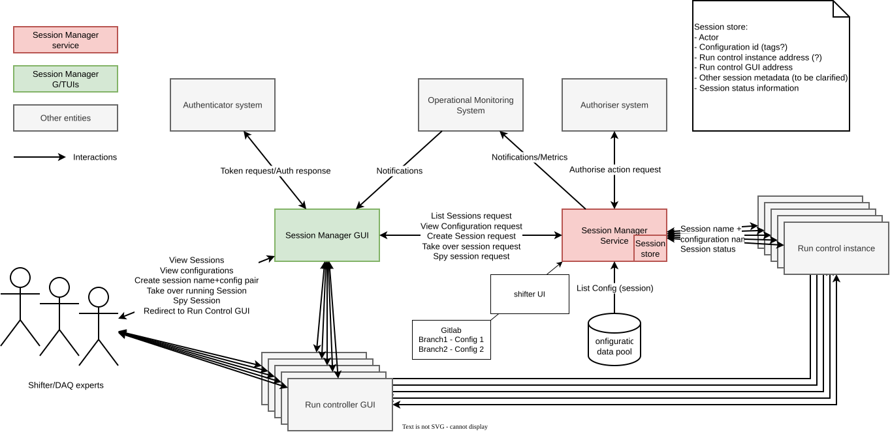 | [Open in draw.io](https://app.diagrams.net/#HPawelPlesniak%2Fdunedaq-diagrams%2Fmain%2Fsrc%2FCCM%2FSessionManager2.drawio) |

## CCM

### Archive

| Diagram | Preview | Edit |
|---|---|---|
| CCM_overall | 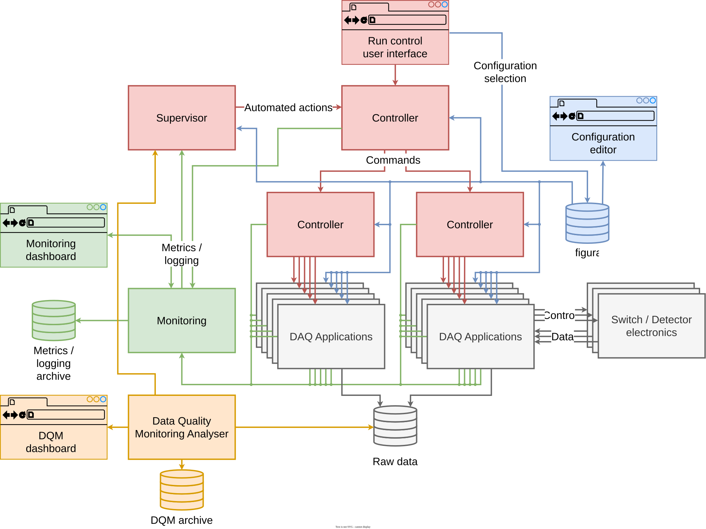 | [Open in draw.io](https://app.diagrams.net/#HPawelPlesniak%2Fdunedaq-diagrams%2Fmain%2Fsrc%2FCCM%2FArchive%2FCCM_overall.drawio) |
| DAQ-overview-DQM | 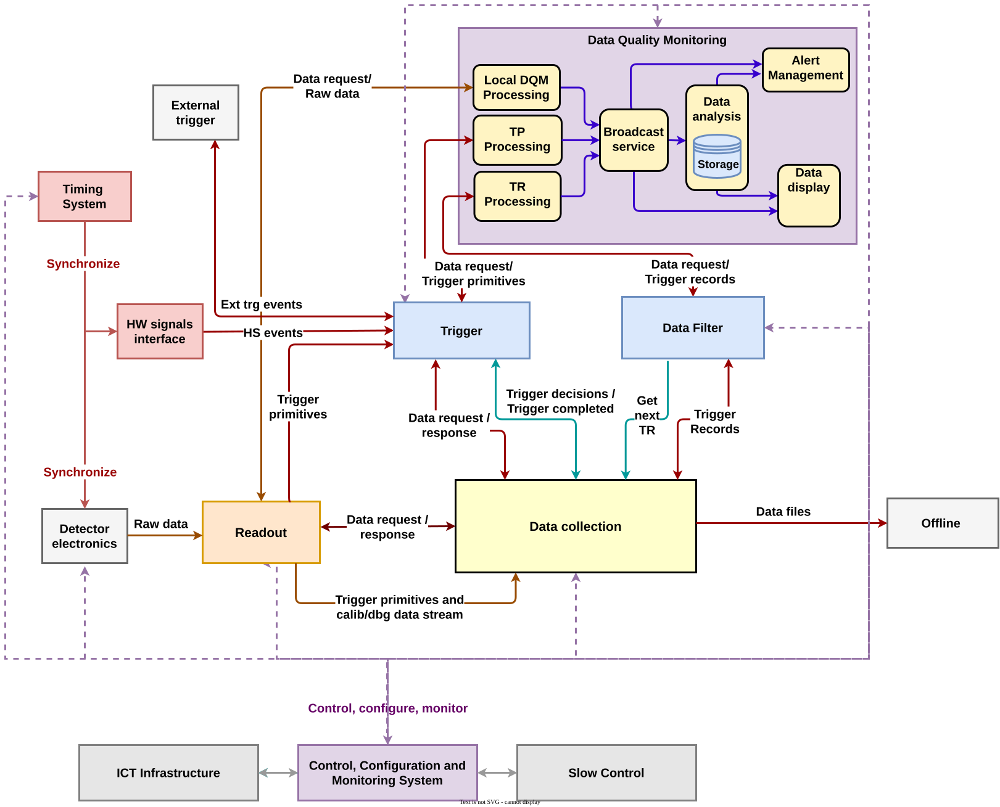 | [Open in draw.io](https://app.diagrams.net/#HPawelPlesniak%2Fdunedaq-diagrams%2Fmain%2Fsrc%2FCCM%2FArchive%2FDAQ-overview-DQM.drawio) |
| DAQApp interactions | 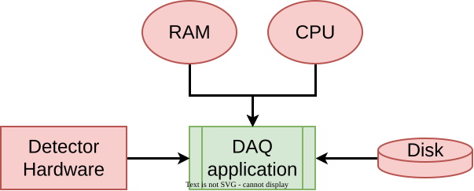 | [Open in draw.io](https://app.diagrams.net/#HPawelPlesniak%2Fdunedaq-diagrams%2Fmain%2Fsrc%2FCCM%2FArchive%2FDAQApp%20interactions.drawio) |
| DAQ_2022 | 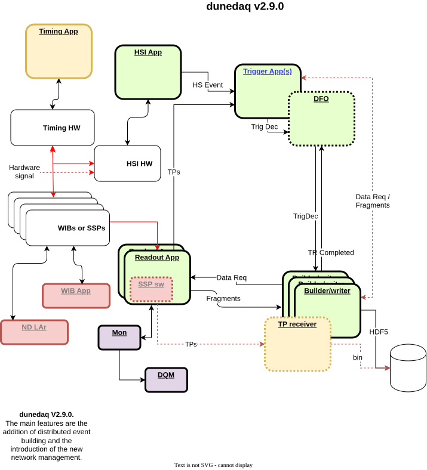 | [Open in draw.io](https://app.diagrams.net/#HPawelPlesniak%2Fdunedaq-diagrams%2Fmain%2Fsrc%2FCCM%2FArchive%2FDAQ_2022.drawio) |
| DUNE_FSM | 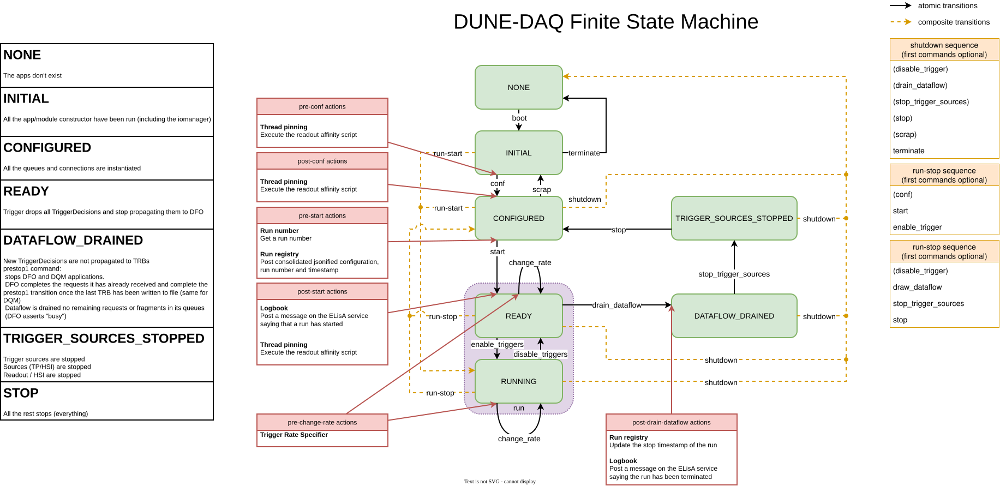 | [Open in draw.io](https://app.diagrams.net/#HPawelPlesniak%2Fdunedaq-diagrams%2Fmain%2Fsrc%2FCCM%2FArchive%2FDUNE_FSM.drawio) |
| DUNE_RC | 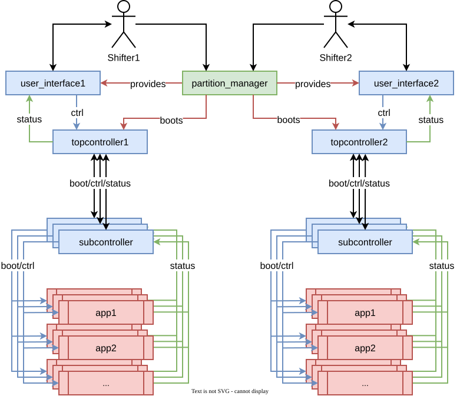 | [Open in draw.io](https://app.diagrams.net/#HPawelPlesniak%2Fdunedaq-diagrams%2Fmain%2Fsrc%2FCCM%2FArchive%2FDUNE_RC.drawio) |
| FSMActionUML |  | [Open in draw.io](https://app.diagrams.net/#HPawelPlesniak%2Fdunedaq-diagrams%2Fmain%2Fsrc%2FCCM%2FArchive%2FFSMActionUML.drawio) |
| NanoRC_simple | 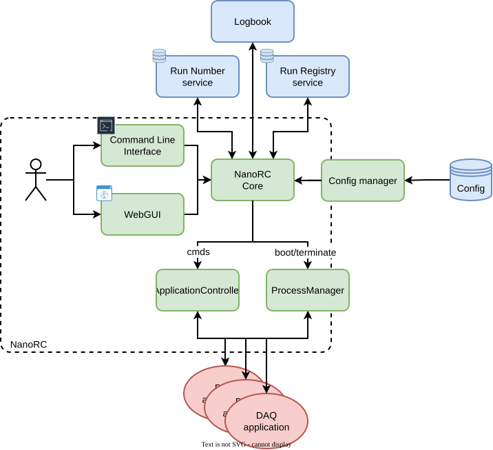 | [Open in draw.io](https://app.diagrams.net/#HPawelPlesniak%2Fdunedaq-diagrams%2Fmain%2Fsrc%2FCCM%2FArchive%2FNanoRC_simple.drawio) |
| configuration | 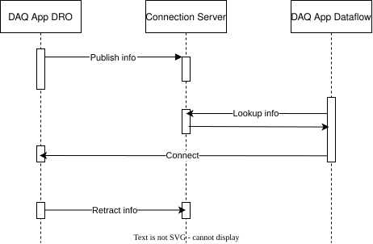 | [Open in draw.io](https://app.diagrams.net/#HPawelPlesniak%2Fdunedaq-diagrams%2Fmain%2Fsrc%2FCCM%2FArchive%2Fconfiguration.drawio) |
| configuration-fdr |  | [Open in draw.io](https://app.diagrams.net/#HPawelPlesniak%2Fdunedaq-diagrams%2Fmain%2Fsrc%2FCCM%2FArchive%2Fconfiguration-fdr.drawio) |
| configuration_messages | 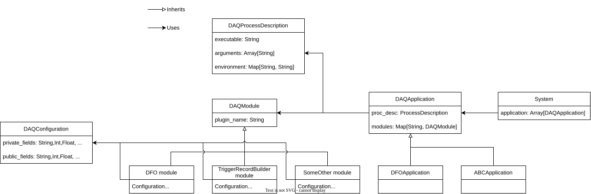 | [Open in draw.io](https://app.diagrams.net/#HPawelPlesniak%2Fdunedaq-diagrams%2Fmain%2Fsrc%2FCCM%2FArchive%2Fconfiguration_messages.drawio) |
| k8s | 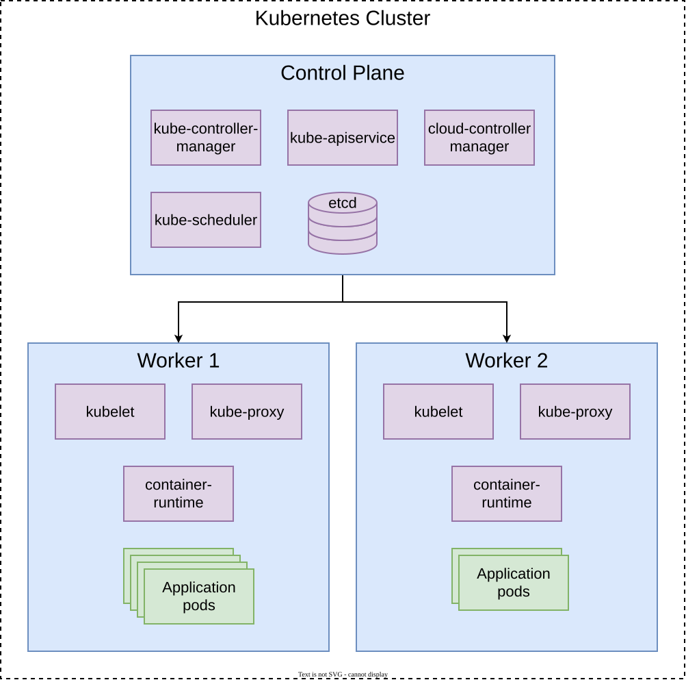 | [Open in draw.io](https://app.diagrams.net/#HPawelPlesniak%2Fdunedaq-diagrams%2Fmain%2Fsrc%2FCCM%2FArchive%2Fk8s.drawio) |
| k8s-ccm-diagrams | 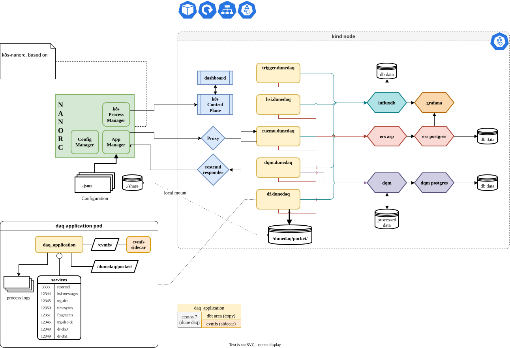 | [Open in draw.io](https://app.diagrams.net/#HPawelPlesniak%2Fdunedaq-diagrams%2Fmain%2Fsrc%2FCCM%2FArchive%2Fk8s-ccm-diagrams.drawio) |
| monitoring | 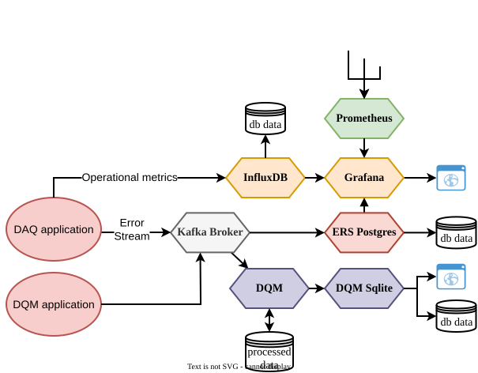 | [Open in draw.io](https://app.diagrams.net/#HPawelPlesniak%2Fdunedaq-diagrams%2Fmain%2Fsrc%2FCCM%2FArchive%2Fmonitoring.drawio) |
| monitoring_v3.1 | 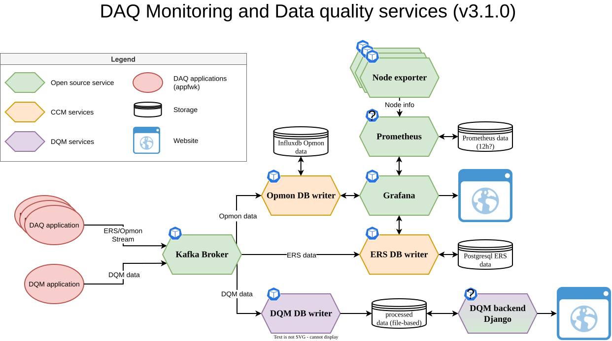 | [Open in draw.io](https://app.diagrams.net/#HPawelPlesniak%2Fdunedaq-diagrams%2Fmain%2Fsrc%2FCCM%2FArchive%2Fmonitoring_v3.1.drawio) |
| opmon_in_appfwk | 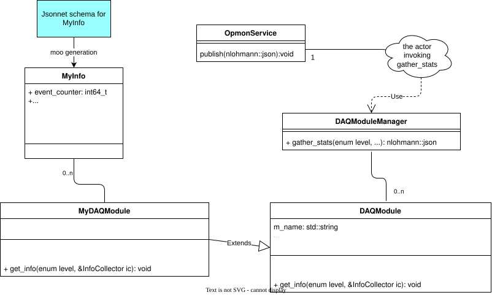 | [Open in draw.io](https://app.diagrams.net/#HPawelPlesniak%2Fdunedaq-diagrams%2Fmain%2Fsrc%2FCCM%2FArchive%2Fopmon_in_appfwk.drawio) |
| overview_CCM | 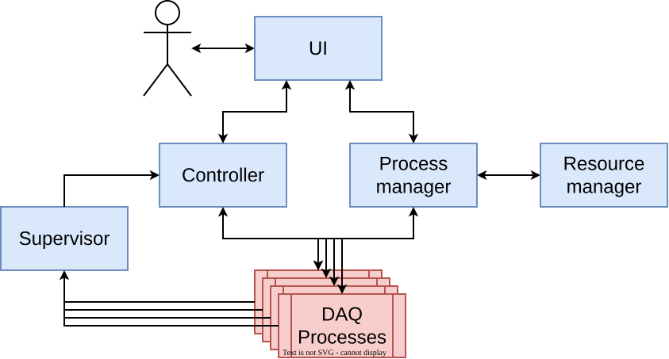 | [Open in draw.io](https://app.diagrams.net/#HPawelPlesniak%2Fdunedaq-diagrams%2Fmain%2Fsrc%2FCCM%2FArchive%2Foverview_CCM.drawio) |

## Facilities_and_Infrastructure

| Diagram | Preview | Edit |
|---|---|---|
| DUNE_Detector_Fiber_Plant-v3-HD_Fiber_Plant |  | [Open in draw.io](https://app.diagrams.net/#HPawelPlesniak%2Fdunedaq-diagrams%2Fmain%2Fsrc%2FFacilities_and_Infrastructure%2FDUNE_Detector_Fiber_Plant-v3-HD_Fiber_Plant.drawio) |
| DUNE_Detector_Fiber_Plant-v3-VD_Fiber_Plant |  | [Open in draw.io](https://app.diagrams.net/#HPawelPlesniak%2Fdunedaq-diagrams%2Fmain%2Fsrc%2FFacilities_and_Infrastructure%2FDUNE_Detector_Fiber_Plant-v3-VD_Fiber_Plant.drawio) |
| DUNE_Detector_Fiber_Plant-v3-VD_Fiber_Plant_Detector_Top_Readout |  | [Open in draw.io](https://app.diagrams.net/#HPawelPlesniak%2Fdunedaq-diagrams%2Fmain%2Fsrc%2FFacilities_and_Infrastructure%2FDUNE_Detector_Fiber_Plant-v3-VD_Fiber_Plant_Detector_Top_Readout.drawio) |
